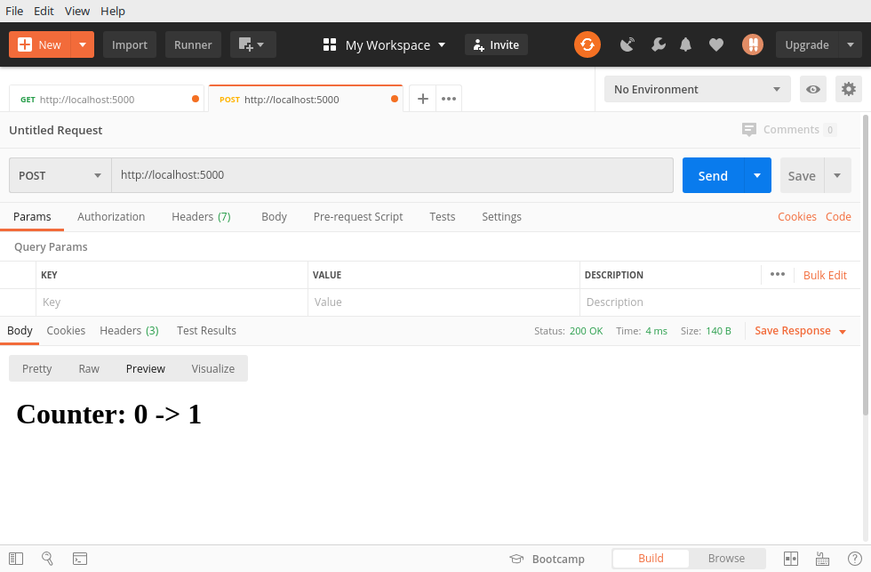

# Package sharpvik/mux

This package seeks to provide customizable and convenient internal routing for
Go's `http.Server`.

When building a server-side app or a REST API, you may wish to implement
complex routing mechanisms that allow you to effectively process incoming
requests by checking its signature against different routes with preset filters.

There already exist a few packages that provide this functionality. However,
there is a catch: those packages are written as though the only things your
handler functions are going to be working with are `http.ResponseWriter` and
`http.Request` sent by the user. In reality, you may wish to query a database
and/or log some data through `log.Logger`. Of course, there are ways to allow
function to acces those interfaces via a global variable or something like that,
but those are a pain to write tests for.

In this package, you can find the Router sturct that is written in a way that
resolves those problems by supporting the router-embedded context.


## Install

```bash
go get github.com/sharpvik/mux
```


## Basic Example

```go
package main

import (
	"net/http"
	"fmt"
	"log"
	"os"

	"github.com/sharpvik/mux"
)

// Define your custom Context type.
type Context struct {
	logger  *log.Logger
	message string
}

// Make NewContext return a *reference* -- it's more memory efficient and safer
// in cases where you are mutating some fields in Context.
func NewContext(l *log.Logger, m string) *Context {
	return &Context{l, m}
}

func main() {
	// Initialize new Router.
	rtr := mux.New(NewContext(
		log.New(os.Stdout, "🚀", log.Ltime),
		"Cheer up, life's beautiful :)",
	))

	// Set router's View to homeView.
	rtr.View = homeView

	http.ListenAndServe(":5000", rtr)
}

func homeView(w http.ResponseWriter, r *http.Request, ctx mux.Context) {
	// Type assertion is required here to retrieve stuff from ctx.
	context := ctx.(*Context)

	// Fetch logger and message from context. Remember, depending on your
	// definition of the Context type, you may have other things there.
	lgr := context.logger
	msg := context.message

	// Log some things.
	lgr.Printf("Request: %s", r.URL.String())
	lgr.Printf("Response: %s", msg)

	// Write response to the client.
	fmt.Fprintf(w, msg)
}
```


## Theory

Mux allows you to build flexible and fairly complex routing schemas by giving
you the `Router`. To create new `Router` you should use the `New` function just
like you've seen in the example above.

```go
func New(ctx Context) *Router
```

Having a single `Router` may be exactly what you want, but it is unlikely that
you decided to use this package for such basic use case. The *cool* things come
when you make *more* `Router`s! Or, to be more precise, more `Subrouter`s.

```go
func (rtr *Router) Subrouter() *Router
```


### Subrouters With Request Method Filters

Let's suppose that you're trying to create a RESTful API service for counting
guests in a restaurant. Your router has to be able to handle two types of
requests that only differ by method:

1. `PUSH /` - increment counter
2. `GET /` - display current counter

Here's how you'd go about implementing this functionality:

```go
package main

import (
	"fmt"
	"net/http"

	"github.com/sharpvik/mux"
)

// Define your custom Context type.
type Counter struct {
	c int
}

func NewCounter() *Counter {
	return &Counter{0}
}

func (c *Counter) inc() {
	c.c++
}

func main() {
	root := mux.New(NewCounter())

	getter := root.Subrouter().Methods("GET")
	getter.View = func(w http.ResponseWriter, r *http.Request, c mux.Context) {
		fmt.Fprintf(w, "<h1>Counter: %d</h1>", c.(*Counter).c)
	}

	poster := root.Subrouter().Methods("POST")
	poster.View = func(w http.ResponseWriter, r *http.Request, c mux.Context) {
		counter := c.(*Counter)
		fmt.Fprintf(w, "<h1>Counter: %d -> ", counter.c)
		counter.inc()
		fmt.Fprintf(w, "%d</h1>", counter.c)
	}

	http.ListenAndServe(":5000", root)
}
```

> We are not worried about concurrency here since it's just a demo but you
> should be. If you are mutating things in your `Context`, you should (1) pass
> it as a reference and (2) think about having a mutex lock attached.

Note, that we are putting *filters* like `Methods` and `Path` (which you'll see
later) on the **sub-routers** -- *not* on the `root`. The `root` will have each
sub-router registered in a slice. Once there is a new incoming request, it will
ask each sub-router -- in the exact order those were registered -- whether
they'd like to handle that request. The sub-routers check their filters (which
you assign) and then respond.

> If no single sub-router wanted to handle the request, `Router` looks at its
> own `View` field. If that's `nil`, it will send back its `Fail` message as
> a last resort measure.

At this point, you can run ths server on `localhost` and see for yourself. You
could use a tool like [Postman](https://www.postman.com/). Here are some
screenshots:


Let's send a `POST` request now...




### Path Filters & Path Variables

But all that is pretty simple. Let's look at something more interesting! Suppose
now your boss asks you that, in order to simplify interactions with this API, it
must provide all that functionality though `GET` requests **only** using these
two request examples:

1. `GET /` - display current counter
2. `GET /alt/5` - increment counter by a certain number

The first handler will stay the same. The second one will have
to change though. *Piece of cake!* Here's what you come up with (only showing
the changes):

```go
// Let's improve our Counter altering method! Now it accepts a number.
func (c *Counter) alt(n int) {
	c.c += n
}

func main() {
	root := mux.New(NewCounter())

	poster := root.Subrouter().Methods("GET").Path("/alt/{n:int}")
	// Let's introduce a *path variable* -----------------^
	poster.View = func(w http.ResponseWriter, r *http.Request, c mux.Context) {
		counter := c.(*Counter)

		// Retreive path variables. It's a map[string]interface{}.
		vars, ok := mux.Vars(r)
		if !ok {
			panic("caramba!")
		}

		// Assert type interface{} -> int.
		n := vars["n"].(int)
		fmt.Fprintf(w, "<h1>Counter: %d -> ", counter.c)
		counter.alt(n)
		fmt.Fprintf(w, "%d</h1>", counter.c)
	}

	getter := root.Subrouter().Methods("GET")
	// No changes in getter's View.
}
```

> The `getter`'s `View` didn't need to change, but we moved it's registration
> point *after* the `poster` because its only filter is by method `GET` which
> matches **every** `poster`'s request as well.

Mux supports multiple different types like `int`, `str`, `nat` (natural
numbers), and pure `regex` expressions as well! By implication, `int` matches
both positive and *negative* numbers, so you would be able to also decrement
your counter using something like `GET /alt/-5`.


### Path Prefix Checks

Sometimes you want to create very complex routing trees that include lots of
nodes and routes. For example, look at this API routing schema:

```
/song
	/file/{songid:nat}
	/info/{songid:nat}

/album
	/cover
		/songid/{id:nat}
		/albumid/{id:nat}
	/info
		/songid/{id:nat}
		/albumid/{id:nat}
```

If you trace this tree down to its children, you'd be able to tell that there
are 6 of them. And you could, of course, simply create 6 sub-routers to your
`root`, but that would be very repetitive. All these paths have many things in
common and those things are called *path prefixes*.

Let's see how registering this tree looks like when you're using Mux!

```go
func main() {
	root := mux.New(NewContext())

	song := root.Subrouter().PathPrefix("/song")

	songfile := song.Subrouter().Path("/file/{songid:nat}")
	songinfo := song.Subrouter().Path("/info/{songid:nat}")

	album := root.Subrouter().PathPrefix("/album")

	albumcover := album.Subrouter().PathPrefix("/cover")
	coversongid := albumcover.Subrouter().Path("/songid/{id:nat}")
	coveralbumid := albumcover.Subrouter().Path("/albumid/{id:nat}")

	albuminfo := album.Subrouter().PathPrefix("/info")
	infosongid := albumcover.Subrouter().Path("/songid/{id:nat}")
	infoalbumid := albumcover.Subrouter().Path("/albumid/{id:nat}")
}
```


## License

Use of this source code is governed by the *Mozilla Public License Version 2.0*
that can be found in the [LICENSE](LICENSE) file.